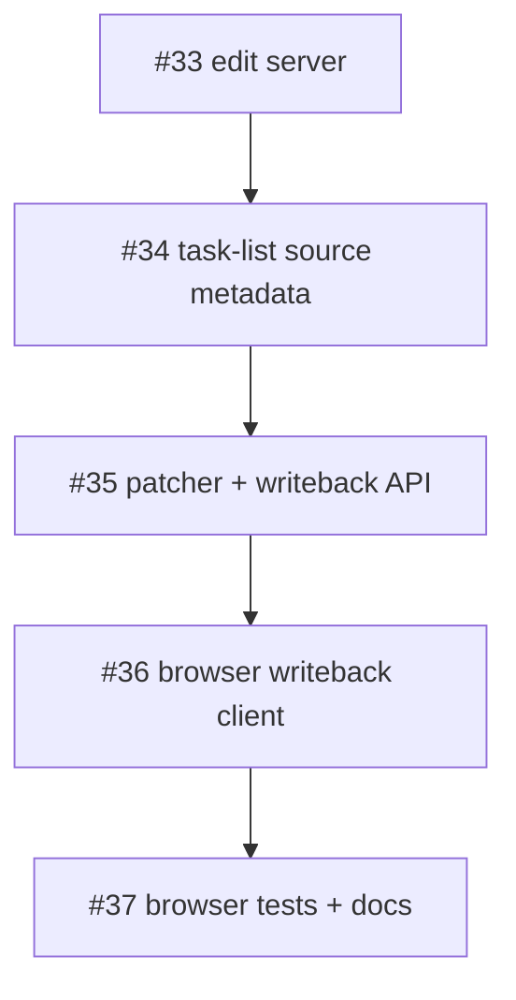

# Task List Writeback Implementation Plan

> **For Hermes:** Use subagent-driven-development skill to implement this plan task-by-task.

**Goal:** Build the first Agent Isles writeback feature: an explicit localhost edit mode where rendered Markdown task-list checkboxes can safely patch the original Markdown source.

**Architecture:** Keep `isles render` and `isles watch` static/source-driven. Add a separate `isles edit` command that starts a localhost-only HTTP server, renders with edit-mode metadata, injects a small browser writeback client, and accepts authenticated writeback requests that patch only the selected source file. The MVP supports only Markdown task-list toggles; component attribute writeback and rich editing are intentionally out of scope.

**Tech Stack:** Node.js ESM, built-in `node:http`, `node:crypto`, existing unified/remark/rehype renderer, Playwright browser tests, `node:test` unit tests.

---

## GitHub work packet map

Parent: #31 — Writeback: task-list writeback MVP

Dependency order:



Issues:

1. #33 — Writeback 1/5: add explicit `isles edit` localhost server
2. #34 — Writeback 2/5: add edit-mode task-list source metadata
3. #35 — Writeback 3/5: implement task-list patcher and writeback API
4. #36 — Writeback 4/5: add browser writeback client for task checkboxes
5. #37 — Writeback 5/5: add browser smoke tests and documentation

## Non-goals for this MVP

- No Gantt drag editing.
- No component attribute writeback.
- No arbitrary text editing.
- No table cell editing.
- No collaborative editing or CRDTs.
- No browser-local state persistence beyond transient save/error UI.
- No network binding beyond localhost by default.

## Security model

`isles edit` is a source-mutation mode and must be explicit.

Rules:

- Bind to `127.0.0.1` by default.
- Generate a per-server random token.
- Inject the token only into the served edit page.
- Require the token on writeback requests.
- Patch only the single source file passed to `isles edit`.
- Do not accept arbitrary file paths from the browser.
- Validate source line/hash before mutation.
- Return conflict errors for stale source.
- Keep static `isles render` output inert.

## Target user flow

Source:

```md
# Launch checklist

- [ ] Finalize Gantt API
- [x] Add screenshot previews
```

Command:

```bash
isles edit launch-checklist.md
```

Terminal:

```txt
[isles] edit server: http://127.0.0.1:4317/
[isles] source: /path/to/launch-checklist.md
[isles] writeback enabled for Markdown task lists
```

Browser click on the first checkbox patches the source to:

```md
# Launch checklist

- [x] Finalize Gantt API
- [x] Add screenshot previews
```

---

## Task 1: Add `isles edit` CLI parsing (#33)

**Objective:** Add the public CLI command shape without starting the server implementation yet.

**Files:**
- Modify: `bin/isles.mjs`
- Test: `tests/render.test.mjs` or new `tests/edit-server.test.mjs`

**Step 1: Write failing CLI usage test**

Add coverage that `node ./bin/isles.mjs --help` includes:

```txt
isles edit <file.md> [--port <port>] [--host <host>]
```

Run:

```bash
npm run test:unit
```

Expected: FAIL because `edit` is not in usage.

**Step 2: Update usage text**

Add `edit` to `USAGE` in `bin/isles.mjs`:

```txt
isles edit <file.md> [--port <port>] [--host 127.0.0.1]
```

**Step 3: Add command dispatch skeleton**

Add:

```js
} else if (command === 'edit') {
  await runEdit(args);
}
```

Implement `runEdit(args)` as a temporary friendly error or call into the new server once Task 2 exists.

**Step 4: Verify**

Run:

```bash
npm run test:unit
```

Expected: PASS for usage test once skeleton exists.

**Step 5: Commit**

```bash
git add bin/isles.mjs tests/render.test.mjs
git commit -m "feat(cli): add edit command skeleton"
```

---

## Task 2: Add localhost edit server foundation (#33)

**Objective:** Start and stop an HTTP server that serves rendered HTML for the selected Markdown file.

**Files:**
- Create: `src/edit-server.mjs`
- Modify: `bin/isles.mjs`
- Test: `tests/edit-server.test.mjs`

**Step 1: Write failing server startup test**

Create `tests/edit-server.test.mjs` with a test that imports `startEditServer` and starts it with `port: 0`.

Expected API:

```js
const server = await startEditServer(fixture, { port: 0 });
assert.match(server.url, /^http:\/\/127\.0\.0\.1:\d+\/$/);
await server.close();
```

Run:

```bash
npm run test:unit
```

Expected: FAIL because `src/edit-server.mjs` does not exist.

**Step 2: Implement minimal server**

`src/edit-server.mjs` should:

- validate the Markdown input via existing renderer helpers,
- create `node:http` server,
- listen on `host = '127.0.0.1'`, `port = 0` by default for tests,
- render Markdown to HTML for `GET /`,
- expose `{ url, close, sourceFile, token }`.

Use built-in APIs only; do not add Express.

**Step 3: Wire CLI**

`runEdit(args)` should parse:

- first non-flag arg as input,
- `--port <number>`,
- `--host <host>`.

Then call `startEditServer(inputPath, { port, host })` and print server URL.

**Step 4: Verify**

Run:

```bash
npm run test:unit
node ./bin/isles.mjs edit tests/fixtures/simple.md --port 0
```

For the foreground manual command, interrupt after verifying URL output.

**Step 5: Commit**

```bash
git add bin/isles.mjs src/edit-server.mjs tests/edit-server.test.mjs
git commit -m "feat(writeback): add localhost edit server"
```

---

## Task 3: Add edit-mode render option and page marker (#33)

**Objective:** Let the renderer produce edit-mode HTML only when explicitly requested.

**Files:**
- Modify: `src/render.mjs`
- Modify: `src/edit-server.mjs`
- Test: `tests/edit-server.test.mjs` or `tests/render.test.mjs`

**Step 1: Write failing test**

Assert:

```js
const html = await renderMarkdown('# Demo', { editMode: true });
assert.match(html, /data-agent-isles-edit-mode="true"/);
```

Also assert normal render does not include the marker.

**Step 2: Implement marker**

In `buildHtmlPage`, when `options.editMode` is true, add something like:

```html
<body data-agent-isles-edit-mode="true">
```

or on the main container:

```html
<main class="agent-isles-page container py-4" data-agent-isles-edit-mode="true">
```

**Step 3: Pass edit mode from server**

`startEditServer` should call:

```js
renderMarkdownFile(sourceFile, { editMode: true })
```

or render from file content with `renderMarkdown(..., { editMode: true })`.

**Step 4: Verify**

Run:

```bash
npm run test:unit
```

**Step 5: Commit**

```bash
git add src/render.mjs src/edit-server.mjs tests/*.test.mjs
git commit -m "feat(writeback): mark edit-mode renders"
```

---

## Task 4: Add task-list source metadata in edit mode (#34)

**Objective:** Convert Markdown task-list checkboxes into enabled writeback controls with deterministic source metadata only in edit mode.

**Files:**
- Modify: `src/render.mjs`
- Test: `tests/writeback-render.test.mjs` or `tests/render.test.mjs`
- Fixture: optional `tests/fixtures/task-list.md`

**Design note:** Existing remark/rehype output includes disabled checkboxes, but not source lines. For the MVP, add a preprocessing/source-map pass over the Markdown before rendering:

1. Scan source lines for Markdown task-list items matching:
   ```regex
   /^(\s*[-*+]\s+\[)( |x|X)(\]\s+.*)$/
   ```
2. Store records `{ line, checked, hash, text }` in order.
3. After HTML body rendering, transform task-list checkbox inputs in order only when `editMode` is true.
4. Add metadata based on the corresponding record.

This avoids trying to recover Markdown source positions from rehype output in the first slice.

**Step 1: Write failing tests**

Static render:

```js
const staticHtml = await renderMarkdown('- [ ] open');
assert.match(staticHtml, /<input type="checkbox" disabled>/);
assert.doesNotMatch(staticHtml, /data-agent-writeback/);
```

Edit render:

```js
const editHtml = await renderMarkdown('- [ ] open', { editMode: true });
assert.match(editHtml, /data-agent-writeback="task-list-toggle"/);
assert.match(editHtml, /data-agent-source-line="1"/);
assert.doesNotMatch(editHtml, /disabled/);
```

**Step 2: Add source scanner helper**

Prefer a small internal helper in `src/render.mjs` first. Extract to `src/writeback/source-map.mjs` only if it becomes bulky.

Hash can be Node SHA-256 shortened, or a deterministic lightweight hash. Use Node `crypto` for clarity.

**Step 3: Add HTML checkbox metadata transform**

Keep this constrained. It should only transform checkbox inputs that correspond to scanned Markdown task records.

Add attributes:

```html
data-agent-writeback="task-list-toggle"
data-agent-source-line="1"
data-agent-source-hash="..."
data-agent-checked="false"
```

Remove `disabled` in edit mode.

**Step 4: Verify**

Run:

```bash
npm run test:unit
```

**Step 5: Commit**

```bash
git add src/render.mjs tests/*.test.mjs tests/fixtures/task-list.md
git commit -m "feat(writeback): annotate task-list checkboxes in edit mode"
```

---

## Task 5: Implement task-list patcher (#35)

**Objective:** Add a pure file/string patcher that toggles one Markdown task-list marker with conflict detection.

**Files:**
- Create: `src/writeback/task-list-patcher.mjs`
- Test: `tests/writeback-patcher.test.mjs`

**Step 1: Write failing tests**

Cases:

- unchecked to checked,
- checked to unchecked,
- uppercase `[X]` normalizes to `[x]` or preserves style by explicit decision,
- stale hash rejects,
- non-task line rejects,
- out-of-range line rejects.

Expected API:

```js
const result = patchTaskListToggle(markdown, {
  line: 2,
  sourceHash: hashTaskLine('- [ ] item'),
  checked: true,
});
assert.equal(result.markdown, '- [x] item\n');
```

**Step 2: Implement helpers**

Export:

```js
export function hashTaskLine(line) { ... }
export function patchTaskListToggle(markdown, request) { ... }
```

Use 1-based line numbers in public metadata.

**Step 3: Conflict semantics**

Return or throw structured errors:

```js
{ ok: false, code: 'conflict', message: 'Source line changed since render.' }
```

Tests should assert the file/string is unchanged on conflict.

**Step 4: Verify**

Run:

```bash
npm run test:unit
```

**Step 5: Commit**

```bash
git add src/writeback/task-list-patcher.mjs tests/writeback-patcher.test.mjs
git commit -m "feat(writeback): add task-list patcher"
```

---

## Task 6: Add writeback API route (#35)

**Objective:** Connect the edit server to the patcher with token validation and source-file writes.

**Files:**
- Modify: `src/edit-server.mjs`
- Modify: `src/writeback/task-list-patcher.mjs` if needed
- Test: `tests/edit-server.test.mjs`

**Step 1: Write failing API tests**

Use a temp Markdown file:

```md
- [ ] open task
```

Start edit server on `port: 0`, then POST:

```json
{
  "kind": "task-list-toggle",
  "sourceLine": 1,
  "sourceHash": "...",
  "checked": true
}
```

Assert the temp source file changes to:

```md
- [x] open task
```

Also test missing token returns 401/403 and leaves file unchanged.

**Step 2: Implement route**

Route:

```txt
POST /__agent-isles/writeback
```

Requirements:

- `Content-Type: application/json`.
- Token via header, e.g. `X-Agent-Isles-Token`.
- Reject unknown `kind`.
- Read current source file at write time.
- Patch with `patchTaskListToggle`.
- Write updated Markdown atomically enough for MVP: write the full file only after validation passes.

**Step 3: Return structured JSON**

Success:

```json
{ "ok": true }
```

Conflict:

```json
{ "ok": false, "error": "conflict", "message": "Source line changed since render." }
```

**Step 4: Verify**

Run:

```bash
npm run test:unit
```

**Step 5: Commit**

```bash
git add src/edit-server.mjs src/writeback/task-list-patcher.mjs tests/edit-server.test.mjs
git commit -m "feat(writeback): add task-list writeback API"
```

---

## Task 7: Add browser writeback client (#36)

**Objective:** Let edit-mode pages POST checkbox changes to the local writeback endpoint.

**Files:**
- Create: `src/client/writeback-client.js`
- Modify: `src/render.mjs`
- Modify: `src/edit-server.mjs`
- Test: `tests/render.test.mjs` or `tests/edit-server.test.mjs`

**Step 1: Write failing injection tests**

Assert static render does not include `writeback-client.js`.

Assert edit render includes either:

```html
<script type="module" src="/__agent-isles/writeback-client.js"></script>
```

or an equivalent served asset.

**Step 2: Implement client script**

The client should:

- find checkbox controls with `data-agent-writeback="task-list-toggle"`,
- listen for `change`,
- read source metadata attributes,
- POST to `/__agent-isles/writeback`,
- include `X-Agent-Isles-Token`,
- disable the checkbox while saving,
- re-enable on completion,
- show a small accessible status message.

**Step 3: Serve client asset**

`src/edit-server.mjs` should serve the client script at:

```txt
/__agent-isles/writeback-client.js
```

**Step 4: Handle failure**

On conflict or network error, the client should revert the checkbox to its prior state and show a message.

**Step 5: Verify**

Run:

```bash
npm run test:unit
```

**Step 6: Commit**

```bash
git add src/client/writeback-client.js src/render.mjs src/edit-server.mjs tests/*.test.mjs
git commit -m "feat(writeback): add task-list browser client"
```

---

## Task 8: Add browser smoke tests (#37)

**Objective:** Prove the full loop in a real browser: Markdown source → checkbox click → Markdown source patched.

**Files:**
- Create: `tests/browser/task-list-writeback.spec.mjs`
- Maybe modify: Playwright config if needed

**Step 1: Write Playwright test**

Test flow:

1. Create a temp Markdown file with:
   ```md
   # Checklist

   - [ ] open task
   - [x] done task
   ```
2. Start edit server on an ephemeral port from test code.
3. Navigate to `server.url`.
4. Click the `open task` checkbox.
5. Wait for save status.
6. Read source file and assert `- [x] open task`.
7. Click `done task` checkbox.
8. Assert source file has `- [ ] done task`.
9. Close server.

**Step 2: Verify browser test fails before full client/server path**

Run:

```bash
npm run test:browser
```

Expected before implementation: FAIL. After Tasks 1–7: PASS.

**Step 3: Add conflict test if practical**

A lighter integration test can cover conflicts if browser setup is noisy.

**Step 4: Verify full suite**

Run:

```bash
npm test
npm run render -- --out dist/demo.html
```

**Step 5: Commit**

```bash
git add tests/browser/task-list-writeback.spec.mjs
git commit -m "test(writeback): add task-list browser smoke coverage"
```

---

## Task 9: Document writeback mode (#37)

**Objective:** Make the feature boundary legible to users.

**Files:**
- Modify: `README.md`
- Maybe modify: `docs/wiki/Architecture.md` or `docs/wiki/Roadmap.md`

**Step 1: Add CLI docs**

Document:

```bash
isles edit report.md
```

Explain:

- static render does not write files,
- edit mode can modify the selected Markdown file,
- MVP supports Markdown task-list checkboxes only,
- conflicts require refresh,
- server binds to localhost by default.

**Step 2: Add example**

Before:

```md
- [ ] Review plan
```

After checking in browser:

```md
- [x] Review plan
```

**Step 3: Verify docs render**

Run:

```bash
npm run render -- --out dist/demo.html
npm test
```

**Step 4: Commit**

```bash
git add README.md docs/wiki/*.md
git commit -m "docs(writeback): document task-list edit mode"
```

---

## Final verification checklist

Before reporting implementation complete:

```bash
npm test
npm run render -- --out dist/demo.html
```

Manual smoke:

```bash
tmp=$(mktemp -d)
printf '# Checklist\n\n- [ ] open task\n' > "$tmp/checklist.md"
node ./bin/isles.mjs edit "$tmp/checklist.md" --port 4317
```

Then in browser:

1. Open `http://127.0.0.1:4317/`.
2. Check `open task`.
3. Confirm source file changed:
   ```bash
   grep -- '- \[x\] open task' "$tmp/checklist.md"
   ```

## Release note draft

```md
Agent Isles now includes an explicit local edit mode for Markdown task lists:

- `isles edit report.md` starts a localhost editing server.
- Checking rendered Markdown task-list boxes updates the original `.md` source.
- Static `isles render` output remains inert and does not write files.
```
