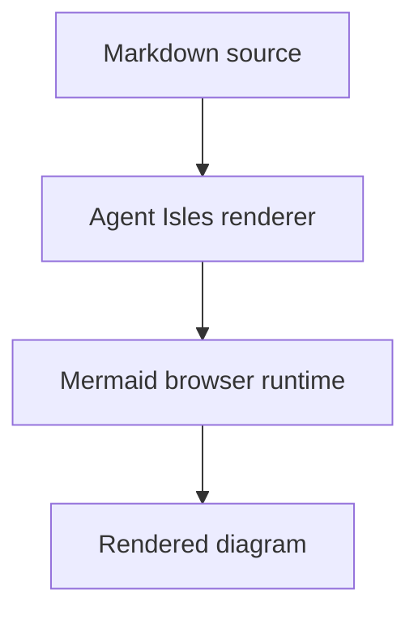

# Agent Isles Demo: Component Gallery

<p class="lead">A complete reference demo where every supported Agent Isles component appears in a rendered/source side-by-side pair.</p>

<style>
.agent-component-example {
  scroll-margin-top: 1rem;
}

.agent-component-pane > :first-child {
  margin-top: 0;
}

.agent-component-source {
  background: #0f172a;
  color: #dbeafe;
  font-size: 0.875rem;
  line-height: 1.55;
  padding: 1rem;
  tab-size: 2;
  white-space: pre-wrap;
}
</style>

> The thread to pull: source Markdown stays boring and reviewable, while the rendered pane shows the richer island a human actually scans.

## Component reference

### Theme toggle

Use `<agent-theme-toggle>` to let readers switch the entire rendered report between light and dark Bootstrap color modes. The toggle updates the document theme and propagates it to every built-in `<agent-*>` island, including nested tabs, timeline steps, Gantt phases/tasks, status items, actions, and Kanban lanes/cards.

<div class="agent-component-example my-4" data-agent-components="agent-theme-toggle">
  <h4 class="h5 mb-3">Theme toggle</h4>
  <div class="row g-4 align-items-stretch">
    <div class="col-12 col-lg-6">
      <div class="agent-component-pane agent-component-rendered border rounded p-3 bg-light h-100">
        <p class="text-uppercase text-primary fw-bold small mb-3">Rendered output</p>
        <agent-theme-toggle label="Theme"></agent-theme-toggle>
      </div>
    </div>
    <div class="col-12 col-lg-6">
      <div class="agent-component-pane agent-component-source-card border rounded p-3 h-100">
        <p class="text-uppercase text-info fw-bold small mb-3">Source Markdown</p>
        <pre class="agent-component-source mb-0"><code>&lt;agent-theme-toggle label="Theme"&gt;&lt;/agent-theme-toggle&gt;</code></pre>
      </div>
    </div>
  </div>
</div>

### Decision island

Use `<agent-decision>` for recommendations, verdicts, and recorded decisions that need a clear stance.

<div class="agent-component-example my-4" data-agent-components="agent-decision">
  <h4 class="h5 mb-3">Decision island</h4>
  <div class="row g-4 align-items-stretch">
    <div class="col-12 col-lg-6">
      <div class="agent-component-pane agent-component-rendered border rounded p-3 bg-light h-100">
        <p class="text-uppercase text-primary fw-bold small mb-3">Rendered output</p>
        <agent-decision verdict="ship-with-guardrails" title="Use Markdown islands for reports">
        Ship the report format as Markdown plus explicit HTML islands. Keep prose portable, use Bootstrap for layout, and reserve components for repeated patterns.
        </agent-decision>
      </div>
    </div>
    <div class="col-12 col-lg-6">
      <div class="agent-component-pane agent-component-source-card border rounded p-3 h-100">
        <p class="text-uppercase text-info fw-bold small mb-3">Source Markdown</p>
        <pre class="agent-component-source mb-0"><code>&lt;agent-decision verdict="ship-with-guardrails" title="Use Markdown islands for reports"&gt;
Ship the report format as Markdown plus explicit HTML islands. Keep prose portable, use Bootstrap for layout, and reserve components for repeated patterns.
&lt;/agent-decision&gt;</code></pre>
      </div>
    </div>
  </div>
</div>

### Risk callout

Use `<agent-risk>` for blockers, hazards, and concerns that need severity plus mitigation context.

<div class="agent-component-example my-4" data-agent-components="agent-risk">
  <h4 class="h5 mb-3">Risk callout</h4>
  <div class="row g-4 align-items-stretch">
    <div class="col-12 col-lg-6">
      <div class="agent-component-pane agent-component-rendered border rounded p-3 bg-light h-100">
        <p class="text-uppercase text-primary fw-bold small mb-3">Rendered output</p>
        <agent-risk level="medium" title="Raw HTML is a trust boundary">
        Current renderer mode is for trusted Markdown. Use safe mode before accepting untrusted input.
        </agent-risk>
      </div>
    </div>
    <div class="col-12 col-lg-6">
      <div class="agent-component-pane agent-component-source-card border rounded p-3 h-100">
        <p class="text-uppercase text-info fw-bold small mb-3">Source Markdown</p>
        <pre class="agent-component-source mb-0"><code>&lt;agent-risk level="medium" title="Raw HTML is a trust boundary"&gt;
Current renderer mode is for trusted Markdown. Use safe mode before accepting untrusted input.
&lt;/agent-risk&gt;</code></pre>
      </div>
    </div>
  </div>
</div>

### Metric and delta composition

Use `<agent-metric>` for compact measurements and `<agent-delta>` for signed comparisons, timeline changes, savings, or regressions.

<div class="agent-component-example my-4" data-agent-components="agent-metric agent-delta">
  <h4 class="h5 mb-3">Metric and delta composition</h4>
  <div class="row g-4 align-items-stretch">
    <div class="col-12 col-lg-6">
      <div class="agent-component-pane agent-component-rendered border rounded p-3 bg-light h-100">
        <p class="text-uppercase text-primary fw-bold small mb-3">Rendered output</p>
        <div class="card shadow-sm">
          <div class="card-body">
            <h5 class="card-title">Timeline comparison</h5>
            <div class="row g-3 mb-3">
              <div class="col-md-6">
                <agent-metric label="Original — no AI, new design" value="38" unit="wks" tone="neutral"></agent-metric>
              </div>
              <div class="col-md-6">
                <agent-metric label="Revised — AI + 1:1 parity + existing assets" value="28" unit="wks" tone="good"></agent-metric>
              </div>
            </div>
            <agent-delta label="Timeline delta" value="-10" unit="wks" percent="-26" direction="lower-better">
        26% faster · ~10 weeks saved
            </agent-delta>
          </div>
        </div>
      </div>
    </div>
    <div class="col-12 col-lg-6">
      <div class="agent-component-pane agent-component-source-card border rounded p-3 h-100">
        <p class="text-uppercase text-info fw-bold small mb-3">Source Markdown</p>
        <pre class="agent-component-source mb-0"><code>&lt;div class="card shadow-sm"&gt;
  &lt;div class="card-body"&gt;
    &lt;h5 class="card-title"&gt;Timeline comparison&lt;/h5&gt;
    &lt;div class="row g-3 mb-3"&gt;
      &lt;div class="col-md-6"&gt;
        &lt;agent-metric label="Original — no AI, new design" value="38" unit="wks" tone="neutral"&gt;&lt;/agent-metric&gt;
      &lt;/div&gt;
      &lt;div class="col-md-6"&gt;
        &lt;agent-metric label="Revised — AI + 1:1 parity + existing assets" value="28" unit="wks" tone="good"&gt;&lt;/agent-metric&gt;
      &lt;/div&gt;
    &lt;/div&gt;
    &lt;agent-delta label="Timeline delta" value="-10" unit="wks" percent="-26" direction="lower-better"&gt;
26% faster · ~10 weeks saved
    &lt;/agent-delta&gt;
  &lt;/div&gt;
&lt;/div&gt;</code></pre>
      </div>
    </div>
  </div>
</div>

### KPI group

Use `<agent-kpi>` for milestone summaries, executive dashboards, and before/after status bands.

<div class="agent-component-example my-4" data-agent-components="agent-kpi">
  <h4 class="h5 mb-3">KPI group</h4>
  <div class="row g-4 align-items-stretch">
    <div class="col-12 col-lg-6">
      <div class="agent-component-pane agent-component-rendered border rounded p-3 bg-light h-100">
        <p class="text-uppercase text-primary fw-bold small mb-3">Rendered output</p>
        <div class="row g-3" role="list" aria-label="Migration milestones">
          <div class="col-md-4" role="listitem">
            <agent-kpi label="Phase 1 dev complete" value="~12" unit="wks" delta="was ~26 wks" tone="success">
        From kick-off
            </agent-kpi>
          </div>
          <div class="col-md-4" role="listitem">
            <agent-kpi label="Live Ireland" value="~15" unit="wks" delta="was ~28 wks" tone="warning">
        Soft launch
            </agent-kpi>
          </div>
          <div class="col-md-4" role="listitem">
            <agent-kpi label="Phase 2 complete" value="~28" unit="wks" delta="was ~38 wks" tone="primary">
        Full delivery
            </agent-kpi>
          </div>
        </div>
      </div>
    </div>
    <div class="col-12 col-lg-6">
      <div class="agent-component-pane agent-component-source-card border rounded p-3 h-100">
        <p class="text-uppercase text-info fw-bold small mb-3">Source Markdown</p>
        <pre class="agent-component-source mb-0"><code>&lt;div class="row g-3" role="list" aria-label="Migration milestones"&gt;
  &lt;div class="col-md-4" role="listitem"&gt;
    &lt;agent-kpi label="Phase 1 dev complete" value="~12" unit="wks" delta="was ~26 wks" tone="success"&gt;
From kick-off
    &lt;/agent-kpi&gt;
  &lt;/div&gt;
  &lt;div class="col-md-4" role="listitem"&gt;
    &lt;agent-kpi label="Live Ireland" value="~15" unit="wks" delta="was ~28 wks" tone="warning"&gt;
Soft launch
    &lt;/agent-kpi&gt;
  &lt;/div&gt;
  &lt;div class="col-md-4" role="listitem"&gt;
    &lt;agent-kpi label="Phase 2 complete" value="~28" unit="wks" delta="was ~38 wks" tone="primary"&gt;
Full delivery
    &lt;/agent-kpi&gt;
  &lt;/div&gt;
&lt;/div&gt;</code></pre>
      </div>
    </div>
  </div>
</div>

### Copy block

Use `<agent-copy-block>` for commands, config fragments, prompts, and code a reader is likely to copy.

<div class="agent-component-example my-4" data-agent-components="agent-copy-block">
  <h4 class="h5 mb-3">Copy block</h4>
  <div class="row g-4 align-items-stretch">
    <div class="col-12 col-lg-6">
      <div class="agent-component-pane agent-component-rendered border rounded p-3 bg-light h-100">
        <p class="text-uppercase text-primary fw-bold small mb-3">Rendered output</p>
        <agent-copy-block lang="bash" label="Render the demo">
        npm run render -- --out dist/demo.html
        </agent-copy-block>
      </div>
    </div>
    <div class="col-12 col-lg-6">
      <div class="agent-component-pane agent-component-source-card border rounded p-3 h-100">
        <p class="text-uppercase text-info fw-bold small mb-3">Source Markdown</p>
        <pre class="agent-component-source mb-0"><code>&lt;agent-copy-block lang="bash" label="Render the demo"&gt;
npm run render -- --out dist/demo.html
&lt;/agent-copy-block&gt;</code></pre>
      </div>
    </div>
  </div>
</div>

### Status board

Use `<agent-status-board>` with `<agent-status-item>` rows for RAG/health rollups across workstreams. The board derives its summary from child rows rather than requiring duplicated counts in Markdown.

Items include visible reference badges like `#1`, `#2` that make it easy to cite specific items (e.g., "Do X with item #2").

<div class="agent-component-example my-4" data-agent-components="agent-status-board agent-status-item">
  <h4 class="h5 mb-3">Status board</h4>
  <div class="row g-4 align-items-stretch">
    <div class="col-12 col-lg-6">
      <div class="agent-component-pane agent-component-rendered border rounded p-3 bg-light h-100">
        <p class="text-uppercase text-primary fw-bold small mb-3">Rendered output</p>
        <agent-status-board label="Project health" meta="wk 24" summary="bar" group-by="status">
          <agent-status-item label="Renderer" status="green" owner="Merlin" updated="mon" history="g,g,g,g">
        CI green; render smoke passing for 9 days.
          </agent-status-item>
          <agent-status-item label="Writeback" status="amber" owner="Zach" updated="tue" history="g,g,a,a">
        Blocked on API boundary decision. Localhost auth design due Thu.
          </agent-status-item>
          <agent-status-item label="Pages" status="amber" owner="Merlin" updated="wed" history="a,a,a,a">
        Publishing is pending until GitHub Pages is enabled by a repo owner.
          </agent-status-item>
          <agent-status-item label="Docs" status="green" owner="Merlin" updated="wed" history="g,g,g,g">
        Component vocabulary mirror is current with the public wiki.
          </agent-status-item>
        </agent-status-board>
        <agent-status-board label="Component readiness">
          <agent-status-item label="KPI" status="green" owner="Merlin">
        Stable and covered by browser smoke.
          </agent-status-item>
          <agent-status-item label="Status board" status="amber" owner="Merlin">
        New island under review; verify grouped lanes and summary behavior.
          </agent-status-item>
        </agent-status-board>
      </div>
    </div>
    <div class="col-12 col-lg-6">
      <div class="agent-component-pane agent-component-source-card border rounded p-3 h-100">
        <p class="text-uppercase text-info fw-bold small mb-3">Source Markdown</p>
        <pre class="agent-component-source mb-0"><code>&lt;agent-status-board label="Project health" meta="wk 24" summary="bar" group-by="status"&gt;
  &lt;agent-status-item label="Renderer" status="green" owner="Merlin" updated="mon" history="g,g,g,g"&gt;
CI green; render smoke passing for 9 days.
  &lt;/agent-status-item&gt;
  &lt;agent-status-item label="Writeback" status="amber" owner="Zach" updated="tue" history="g,g,a,a"&gt;
Blocked on API boundary decision. Localhost auth design due Thu.
  &lt;/agent-status-item&gt;
  &lt;agent-status-item label="Pages" status="amber" owner="Merlin" updated="wed" history="a,a,a,a"&gt;
Publishing is pending until GitHub Pages is enabled by a repo owner.
  &lt;/agent-status-item&gt;
  &lt;agent-status-item label="Docs" status="green" owner="Merlin" updated="wed" history="g,g,g,g"&gt;
Component vocabulary mirror is current with the public wiki.
  &lt;/agent-status-item&gt;
&lt;/agent-status-board&gt;
&lt;agent-status-board label="Component readiness"&gt;
  &lt;agent-status-item label="KPI" status="green" owner="Merlin"&gt;
Stable and covered by browser smoke.
  &lt;/agent-status-item&gt;
  &lt;agent-status-item label="Status board" status="amber" owner="Merlin"&gt;
New island under review; verify grouped lanes and summary behavior.
  &lt;/agent-status-item&gt;
&lt;/agent-status-board&gt;</code></pre>
      </div>
    </div>
  </div>
</div>

### Kanban board

Use `<agent-kanban>` with `<agent-kanban-lane>` and `<agent-kanban-card>` for source-order swim lanes where counts and status/card metadata should be derived from readable nested HTML.

<div class="agent-component-example my-4" data-agent-components="agent-kanban agent-kanban-lane agent-kanban-card">
  <h4 class="h5 mb-3">Kanban board</h4>
  <div class="row g-4 align-items-stretch">
    <div class="col-12 col-lg-6">
      <div class="agent-component-pane agent-component-rendered border rounded p-3 bg-light h-100">
        <p class="text-uppercase text-primary fw-bold small mb-3">Rendered output</p>
        <agent-kanban label="Launch board" lanes="backlog,doing,blocked,done">
          <agent-kanban-lane key="backlog" label="Backlog">
            <agent-kanban-card title="Draft release notes" owner="Merlin" meta="P2" tone="neutral">
        Summarize merged component work and remaining release risks.
            </agent-kanban-card>
          </agent-kanban-lane>
          <agent-kanban-lane key="doing" label="Doing">
            <agent-kanban-card title="Render smoke" owner="Merlin" meta="P1" status="active" tone="active">
        Verify the demo after component bundle changes.
            </agent-kanban-card>
            <agent-kanban-card title="Review docs" owner="Zach" meta="P2" status="ready" tone="ready">
        Confirm the authoring guidance is readable in source form.
            </agent-kanban-card>
          </agent-kanban-lane>
          <agent-kanban-lane key="blocked" label="Blocked" empty="No blocked work"></agent-kanban-lane>
          <agent-kanban-lane key="done" label="Done" empty="No completed cards yet"></agent-kanban-lane>
        </agent-kanban>
      </div>
    </div>
    <div class="col-12 col-lg-6">
      <div class="agent-component-pane agent-component-source-card border rounded p-3 h-100">
        <p class="text-uppercase text-info fw-bold small mb-3">Source Markdown</p>
        <pre class="agent-component-source mb-0"><code>&lt;agent-kanban label="Launch board" lanes="backlog,doing,blocked,done"&gt;
  &lt;agent-kanban-lane key="backlog" label="Backlog"&gt;
    &lt;agent-kanban-card title="Draft release notes" owner="Merlin" meta="P2" tone="neutral"&gt;
Summarize merged component work and remaining release risks.
    &lt;/agent-kanban-card&gt;
  &lt;/agent-kanban-lane&gt;
  &lt;agent-kanban-lane key="doing" label="Doing"&gt;
    &lt;agent-kanban-card title="Render smoke" owner="Merlin" meta="P1" status="active" tone="active"&gt;
Verify the demo after component bundle changes.
    &lt;/agent-kanban-card&gt;
    &lt;agent-kanban-card title="Review docs" owner="Zach" meta="P2" status="ready" tone="ready"&gt;
Confirm the authoring guidance is readable in source form.
    &lt;/agent-kanban-card&gt;
  &lt;/agent-kanban-lane&gt;
  &lt;agent-kanban-lane key="blocked" label="Blocked" empty="No blocked work"&gt;&lt;/agent-kanban-lane&gt;
  &lt;agent-kanban-lane key="done" label="Done" empty="No completed cards yet"&gt;&lt;/agent-kanban-lane&gt;
&lt;/agent-kanban&gt;</code></pre>
      </div>
    </div>
  </div>
</div>

### Custom status labels

You can override the status pill label while keeping the color token for grouping using `status-color` and `status-label`:

<agent-status-board label="Risk assessment" group-by="status" hide-empty-groups>
  <agent-status-item label="API Authentication" status-color="amber" status-label="Medium Risk" owner="Security Team">
    OAuth flow needs additional validation before production deployment.
  </agent-status-item>
  <agent-status-item label="Database Schema" status-color="amber" status-label="Needs Review" owner="Data Team">
    Migration scripts ready but awaiting peer review.
  </agent-status-item>
  <agent-status-item label="Load Testing" status-color="green" status-label="Verified" owner="QA Team">
    System handles 10x expected traffic with acceptable latency.
  </agent-status-item>
</agent-status-board>

The `hide-empty-groups` option hides status groups with zero items (note: Red and Grey groups are hidden above).

### Dependency map

Use `<agent-dependency-map>` with `<agent-dependency>` nodes to show what blocks what in a plan.

<div class="agent-component-example my-4" data-agent-components="agent-dependency-map agent-dependency">
  <h4 class="h5 mb-3">Dependency map</h4>
  <div class="row g-4 align-items-stretch">
    <div class="col-12 col-lg-6">
      <div class="agent-component-pane agent-component-rendered border rounded p-3 bg-light h-100">
        <p class="text-uppercase text-primary fw-bold small mb-3">Rendered output</p>
        <agent-dependency-map label="Writeback dependency chain" direction="vertical" legend="show">
          <agent-dependency id="edit-server" label="Edit server" status="ready" owner="Merlin" priority="P0">
        Starts the localhost edit workflow.
          </agent-dependency>
          <agent-dependency id="source-metadata" label="Source metadata" status="blocked" blocked-by="edit-server" owner="Merlin" priority="P0">
        Requires the edit server entrypoint first.
          </agent-dependency>
          <agent-dependency id="patch-api" label="Patch API" status="blocked" blocked-by="source-metadata" owner="Merlin" priority="P1">
        Applies safe task-list source patches.
          </agent-dependency>
          <agent-dependency id="browser-client" label="Browser client" status="blocked" blocked-by="patch-api" owner="Merlin" priority="P1">
        Enables checkbox writeback from rendered output.
          </agent-dependency>
          <agent-dependency id="docs" label="Docs and prompts" status="active" blocked-by="patch-api" owner="Nia" priority="P2">
        Document the safe authoring + edit boundaries and ship example prompts.
          </agent-dependency>
          <agent-dependency id="writeback-release" label="Writeback release" status="risk" blocked-by="browser-client, docs" owner="Ariel" priority="P0">
        Launch when the client and docs converge; treat cross-surface integration as a risk gate.
          </agent-dependency>
        </agent-dependency-map>
      </div>
    </div>
    <div class="col-12 col-lg-6">
      <div class="agent-component-pane agent-component-source-card border rounded p-3 h-100">
        <p class="text-uppercase text-info fw-bold small mb-3">Source Markdown</p>
        <pre class="agent-component-source mb-0"><code>&lt;agent-dependency-map label="Writeback dependency chain" direction="vertical" legend="show"&gt;
  &lt;agent-dependency id="edit-server" label="Edit server" status="ready" owner="Merlin" priority="P0"&gt;
Starts the localhost edit workflow.
  &lt;/agent-dependency&gt;
  &lt;agent-dependency id="source-metadata" label="Source metadata" status="blocked" blocked-by="edit-server" owner="Merlin" priority="P0"&gt;
Requires the edit server entrypoint first.
  &lt;/agent-dependency&gt;
  &lt;agent-dependency id="patch-api" label="Patch API" status="blocked" blocked-by="source-metadata" owner="Merlin" priority="P1"&gt;
Applies safe task-list source patches.
  &lt;/agent-dependency&gt;
  &lt;agent-dependency id="browser-client" label="Browser client" status="blocked" blocked-by="patch-api" owner="Merlin" priority="P1"&gt;
Enables checkbox writeback from rendered output.
  &lt;/agent-dependency&gt;
  &lt;agent-dependency id="docs" label="Docs and prompts" status="active" blocked-by="patch-api" owner="Nia" priority="P2"&gt;
Document the safe authoring + edit boundaries and ship example prompts.
  &lt;/agent-dependency&gt;
  &lt;agent-dependency id="writeback-release" label="Writeback release" status="risk" blocked-by="browser-client, docs" owner="Ariel" priority="P0"&gt;
Launch when the client and docs converge; treat cross-surface integration as a risk gate.
  &lt;/agent-dependency&gt;
&lt;/agent-dependency-map&gt;</code></pre>
      </div>
    </div>
  </div>
</div>

### Tabs

Use `<agent-tabs>` with `<agent-tab>` panels for alternate views, platform-specific instructions, or evidence groups.

<div class="agent-component-example my-4" data-agent-components="agent-tabs agent-tab">
  <h4 class="h5 mb-3">Tabs</h4>
  <div class="row g-4 align-items-stretch">
    <div class="col-12 col-lg-6">
      <div class="agent-component-pane agent-component-rendered border rounded p-3 bg-light h-100">
        <p class="text-uppercase text-primary fw-bold small mb-3">Rendered output</p>
        <agent-tabs>
          <agent-tab title="Phase 1 — Discover" active>
            <p>Map current Markdown patterns and identify reusable component seams.</p>
          </agent-tab>
          <agent-tab title="Phase 2 — Build">
            <p>Implement renderer features, hydrate components, and keep examples inspectable.</p>
          </agent-tab>
          <agent-tab title="Phase 3 — Ship">
            <p>Run browser smoke, publish docs, and keep deployment settings separate.</p>
          </agent-tab>
        </agent-tabs>
      </div>
    </div>
    <div class="col-12 col-lg-6">
      <div class="agent-component-pane agent-component-source-card border rounded p-3 h-100">
        <p class="text-uppercase text-info fw-bold small mb-3">Source Markdown</p>
        <pre class="agent-component-source mb-0"><code>&lt;agent-tabs&gt;
  &lt;agent-tab title="Phase 1 — Discover" active&gt;
    &lt;p&gt;Map current Markdown patterns and identify reusable component seams.&lt;/p&gt;
  &lt;/agent-tab&gt;
  &lt;agent-tab title="Phase 2 — Build"&gt;
    &lt;p&gt;Implement renderer features, hydrate components, and keep examples inspectable.&lt;/p&gt;
  &lt;/agent-tab&gt;
  &lt;agent-tab title="Phase 3 — Ship"&gt;
    &lt;p&gt;Run browser smoke, publish docs, and keep deployment settings separate.&lt;/p&gt;
  &lt;/agent-tab&gt;
&lt;/agent-tabs&gt;</code></pre>
      </div>
    </div>
  </div>
</div>

### Timeline

Use `<agent-timeline>` with `<agent-step>` entries for chronological steps, incident logs, and release phases.

<div class="agent-component-example my-4" data-agent-components="agent-timeline agent-step">
  <h4 class="h5 mb-3">Timeline</h4>
  <div class="row g-4 align-items-stretch">
    <div class="col-12 col-lg-6">
      <div class="agent-component-pane agent-component-rendered border rounded p-3 bg-light h-100">
        <p class="text-uppercase text-primary fw-bold small mb-3">Rendered output</p>
        <agent-timeline label="Discovery progress">
          <agent-step status="done" label="Renderer baseline">
        Markdown, raw HTML islands, theme injection, and browser smoke are in place.
          </agent-step>
          <agent-step status="active" label="Component expansion">
        Status, dependency, action, and schedule islands are being rounded out.
          </agent-step>
          <agent-step status="pending" label="Browser polish">
        Responsive gallery and visual smoke coverage remain the final pass.
          </agent-step>
        </agent-timeline>
      </div>
    </div>
    <div class="col-12 col-lg-6">
      <div class="agent-component-pane agent-component-source-card border rounded p-3 h-100">
        <p class="text-uppercase text-info fw-bold small mb-3">Source Markdown</p>
        <pre class="agent-component-source mb-0"><code>&lt;agent-timeline label="Discovery progress"&gt;
  &lt;agent-step status="done" label="Renderer baseline"&gt;
Markdown, raw HTML islands, theme injection, and browser smoke are in place.
  &lt;/agent-step&gt;
  &lt;agent-step status="active" label="Component expansion"&gt;
Status, dependency, action, and schedule islands are being rounded out.
  &lt;/agent-step&gt;
  &lt;agent-step status="pending" label="Browser polish"&gt;
Responsive gallery and visual smoke coverage remain the final pass.
  &lt;/agent-step&gt;
&lt;/agent-timeline&gt;</code></pre>
      </div>
    </div>
  </div>
</div>

### Gantt chart

Use `<agent-gantt>`, `<agent-gantt-phase>`, and `<agent-gantt-task>` for schedules, phase lanes, milestones, overlap, and details.

<div class="agent-component-example my-4" data-agent-components="agent-gantt agent-gantt-phase agent-gantt-task">
  <h4 class="h5 mb-3">Gantt chart</h4>
  <div class="row g-4 align-items-stretch">
    <div class="col-12 col-lg-6">
      <div class="agent-component-pane agent-component-rendered border rounded p-3 bg-light h-100">
        <p class="text-uppercase text-primary fw-bold small mb-3">Rendered output</p>
        <agent-gantt weeks="28" milestones="12,15,28" label="Migration schedule">
          <agent-gantt-phase label="Core build">
            <agent-gantt-task label="Components + Storybook" start="3" end="5" tone="components" detail="2 wks — was 8 wks; 1:1 parity removes design review loop">
        Component parity keeps the source Markdown simple while the rendered chart shows schedule compression.
            </agent-gantt-task>
            <agent-gantt-task label="Testing — parallel" start="3" end="12" tone="testing" detail="Runs continuously beside component work" parallel>
        Regression and browser smoke coverage run alongside build work instead of waiting for handoff.
            </agent-gantt-task>
          </agent-gantt-phase>
          <agent-gantt-phase label="Launch readiness">
            <agent-gantt-task label="UAT" start="13" end="15" tone="validation" detail="Migration-critical paths only">
        UAT stays scoped to flows that decide whether launch can proceed.
            </agent-gantt-task>
            <agent-gantt-task label="Go-live checkpoint" start="28" end="28" tone="launch" detail="Milestone week 28">
        Final readiness review and publish decision.
            </agent-gantt-task>
          </agent-gantt-phase>
        </agent-gantt>
      </div>
    </div>
    <div class="col-12 col-lg-6">
      <div class="agent-component-pane agent-component-source-card border rounded p-3 h-100">
        <p class="text-uppercase text-info fw-bold small mb-3">Source Markdown</p>
        <pre class="agent-component-source mb-0"><code>&lt;agent-gantt weeks="28" milestones="12,15,28" label="Migration schedule"&gt;
  &lt;agent-gantt-phase label="Core build"&gt;
    &lt;agent-gantt-task label="Components + Storybook" start="3" end="5" tone="components" detail="2 wks — was 8 wks; 1:1 parity removes design review loop"&gt;
Component parity keeps the source Markdown simple while the rendered chart shows schedule compression.
    &lt;/agent-gantt-task&gt;
    &lt;agent-gantt-task label="Testing — parallel" start="3" end="12" tone="testing" detail="Runs continuously beside component work" parallel&gt;
Regression and browser smoke coverage run alongside build work instead of waiting for handoff.
    &lt;/agent-gantt-task&gt;
  &lt;/agent-gantt-phase&gt;
  &lt;agent-gantt-phase label="Launch readiness"&gt;
    &lt;agent-gantt-task label="UAT" start="13" end="15" tone="validation" detail="Migration-critical paths only"&gt;
UAT stays scoped to flows that decide whether launch can proceed.
    &lt;/agent-gantt-task&gt;
    &lt;agent-gantt-task label="Go-live checkpoint" start="28" end="28" tone="launch" detail="Milestone week 28"&gt;
Final readiness review and publish decision.
    &lt;/agent-gantt-task&gt;
  &lt;/agent-gantt-phase&gt;
&lt;/agent-gantt&gt;</code></pre>
      </div>
    </div>
  </div>
</div>

### Action list

Use `<agent-action-list>` with `<agent-action>` items for follow-up work in table, kanban, or priority layouts.

<div class="agent-component-example my-4" data-agent-components="agent-action-list agent-action">
  <h4 class="h5 mb-3">Action list</h4>
  <div class="row g-4 align-items-stretch">
    <div class="col-12 col-lg-6">
      <div class="agent-component-pane agent-component-rendered border rounded p-3 bg-light h-100">
        <p class="text-uppercase text-primary fw-bold small mb-3">Rendered output</p>
        <agent-action-list label="From this demo" layout="table" group-by="status" filter-status="open,in-progress" filter-priority="high,normal" show-done="false">
          <agent-action owner="You" status="open">
        Open examples/demo.md and inspect the source beside the rendered output.
          </agent-action>
          <agent-action owner="You" status="in-progress" priority="high" due="2026-05-24">
        Run the render smoke after changing component examples.
          </agent-action>
          <agent-action owner="Merlin" status="open" priority="high">
        Verify each component appears once as an atomic rendered/source pair.
          </agent-action>
          <agent-action owner="Merlin" status="done" priority="normal">
        Keep the source snippets visible next to the rendered output.
          </agent-action>
        </agent-action-list>
        <agent-action-list label="From standup (minimal)">
          <agent-action owner="You" status="open">Review the generated demo.</agent-action>
          <agent-action owner="Merlin" status="done">Mirror component docs to the wiki.</agent-action>
        </agent-action-list>
        <agent-action-list label="Launch follow-ups (kanban)" layout="kanban" show-done="false">
          <agent-action owner="Merlin" status="open" priority="high">Re-run browser smoke.</agent-action>
          <agent-action owner="Zach" status="in-progress" priority="normal">Review gallery scope.</agent-action>
          <agent-action owner="Merlin" status="blocked" priority="normal">Wait for Pages enablement.</agent-action>
          <agent-action owner="Pix" status="done" priority="low">Mirror component docs to the wiki.</agent-action>
        </agent-action-list>
        <agent-action-list label="Launch follow-ups (priority lanes)" layout="priority" show-done="true">
          <agent-action owner="Merlin" status="open" priority="high">Re-run browser smoke.</agent-action>
          <agent-action owner="Zach" status="in-progress" priority="normal">Review gallery scope.</agent-action>
          <agent-action owner="Pix" status="done" priority="low">Mirror component docs to the wiki.</agent-action>
        </agent-action-list>
      </div>
    </div>
    <div class="col-12 col-lg-6">
      <div class="agent-component-pane agent-component-source-card border rounded p-3 h-100">
        <p class="text-uppercase text-info fw-bold small mb-3">Source Markdown</p>
        <pre class="agent-component-source mb-0"><code>&lt;agent-action-list label="From this demo" layout="table" group-by="status" filter-status="open,in-progress" filter-priority="high,normal" show-done="false"&gt;
  &lt;agent-action owner="You" status="open"&gt;
Open examples/demo.md and inspect the source beside the rendered output.
  &lt;/agent-action&gt;
  &lt;agent-action owner="You" status="in-progress" priority="high" due="2026-05-24"&gt;
Run the render smoke after changing component examples.
  &lt;/agent-action&gt;
  &lt;agent-action owner="Merlin" status="open" priority="high"&gt;
Verify each component appears once as an atomic rendered/source pair.
  &lt;/agent-action&gt;
  &lt;agent-action owner="Merlin" status="done" priority="normal"&gt;
Keep the source snippets visible next to the rendered output.
  &lt;/agent-action&gt;
&lt;/agent-action-list&gt;
&lt;agent-action-list label="From standup (minimal)"&gt;
  &lt;agent-action owner="You" status="open"&gt;Review the generated demo.&lt;/agent-action&gt;
  &lt;agent-action owner="Merlin" status="done"&gt;Mirror component docs to the wiki.&lt;/agent-action&gt;
&lt;/agent-action-list&gt;
&lt;agent-action-list label="Launch follow-ups (kanban)" layout="kanban" show-done="false"&gt;
  &lt;agent-action owner="Merlin" status="open" priority="high"&gt;Re-run browser smoke.&lt;/agent-action&gt;
  &lt;agent-action owner="Zach" status="in-progress" priority="normal"&gt;Review gallery scope.&lt;/agent-action&gt;
  &lt;agent-action owner="Merlin" status="blocked" priority="normal"&gt;Wait for Pages enablement.&lt;/agent-action&gt;
  &lt;agent-action owner="Pix" status="done" priority="low"&gt;Mirror component docs to the wiki.&lt;/agent-action&gt;
&lt;/agent-action-list&gt;
&lt;agent-action-list label="Launch follow-ups (priority lanes)" layout="priority" show-done="true"&gt;
  &lt;agent-action owner="Merlin" status="open" priority="high"&gt;Re-run browser smoke.&lt;/agent-action&gt;
  &lt;agent-action owner="Zach" status="in-progress" priority="normal"&gt;Review gallery scope.&lt;/agent-action&gt;
  &lt;agent-action owner="Pix" status="done" priority="low"&gt;Mirror component docs to the wiki.&lt;/agent-action&gt;
&lt;/agent-action-list&gt;</code></pre>
      </div>
    </div>
  </div>
</div>

## Renderer features

### Syntax-highlighted fenced code

Fenced code blocks are highlighted with Highlight.js and remain normal Markdown source.

```javascript
function greet(name) {
  return `Hello, ${name}!`;
}

const message = greet('Agent Isles');
console.log(message);
```

### Mermaid diagram fences

Mermaid fences stay portable in Markdown and are rendered in the browser by the generated Agent Isles page.



### Bundled D2 diagram fences

D2 fences render as SVG diagrams without requiring an external command.

```d2
direction: right

markdown: Markdown input {
  shape: page
}

renderer: Agent Isles {
  shape: hexagon
}

browser: Browser {
  shape: rectangle
}

markdown -> renderer: Fenced\nD2 blocks
renderer -> browser: SVG diagrams
renderer -> browser: HTML + components
```

### Render commands

```bash
npm install
npm test
npm run render -- --out dist/demo.html
node ./bin/isles.mjs render examples/demo.md --show-source --out dist/demo-source.html
```

## Why this matters

Plain Markdown is the sea: durable, portable, and easy to navigate. Islands are the landmarks: decisions, risks, metrics, timelines, schedules, status, dependencies, and actions that deserve stronger shape.
